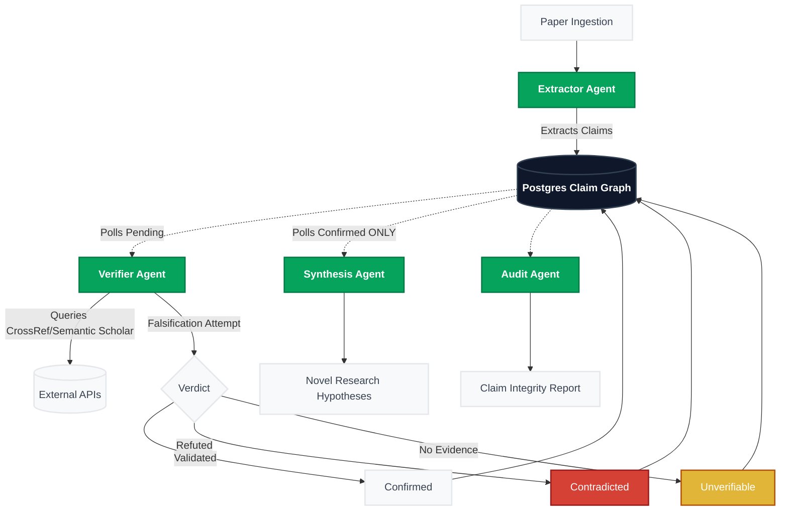

# Popper — Adversarial Multi-Agent Claim Verification

[](https://github.com/Xconmax245/Popper)

> **No claim survives without a fight.**

Popper is an adversarial multi-agent system that extracts factual claims from academic papers, verifies them against real citation sources (CrossRef + Semantic Scholar), and synthesizes research hypotheses only from what survives verification.

**actual demo run cost = $0.00 (free-tier)**

---

## 🚀 Judge Path (5-Minute Eval)

If you're evaluating this project, here is the fastest way to see the core mechanic:
1. Go to `/demo` and paste this URL: `http://localhost:3000/api/demo/fixture-paper` (or simply click **✦ Try demo paper**).
2. Click **Start verification**.
3. Expect the **red flip** at the planted fake claim (LSTM "95% accuracy").
4. Expect the **yellow lock** at naturally unverifiable claims (paywalled or obscure).
5. Expect the **rejection badge** in the execution trace when the Synthesis agent refuses to use the fake claim to generate hypotheses.

---

## Verification Accuracy

| Metric | Result |
|---|---|
| Overall accuracy | **83.3%** (20/24) — CrossRef gate threshold at 0.20 |
| Confirmed precision | **100%** across all runs — Popper has never said "confirmed" and been wrong |
| Contradicted precision | **100%** with CrossRef gate (was 66.7% without it) |
| Contradicted recall | **100%** on pre-gate run — caught every planted error |
| Most common miss | Wrong-DOI CrossRef resolutions (4/5 original misses): gate now blocks junk citations; threshold calibrated to 0.20 after over-gating analysis |

Full breakdown: [`eval/README.md`](eval/README.md)

---

## Architecture

![Popper Architecture Diagram](https://mermaid.ink/img/Zmxvd2NoYXJ0IFRECiAgICAlJSBTdHlsaW5nCiAgICBjbGFzc0RlZiBkZWZhdWx0IGZpbGw6I2Y4ZjlmYSxzdHJva2U6I2U1ZTdlYixzdHJva2Utd2lkdGg6MnB4LGNvbG9yOiMzNzQxNTEKICAgIGNsYXNzRGVmIGFnZW50IGZpbGw6IzA2QTM1RCxzdHJva2U6IzA0N2I0NixzdHJva2Utd2lkdGg6MnB4LGNvbG9yOiNmZmZmZmYsZm9udC13ZWlnaHQ6Ym9sZAogICAgY2xhc3NEZWYgZGIgZmlsbDojMGYxNzJhLHN0cm9rZTojMzM0MTU1LHN0cm9rZS13aWR0aDoycHgsY29sb3I6I2ZmZmZmZixmb250LXdlaWdodDpib2xkCiAgICBjbGFzc0RlZiBmYWlsIGZpbGw6I0Q2NDEzNixzdHJva2U6Izk5MWIxYixzdHJva2Utd2lkdGg6MnB4LGNvbG9yOiNmZmZmZmYKICAgIGNsYXNzRGVmIHdhcm4gZmlsbDojRTBCNTM4LHN0cm9rZTojYjQ1MzA5LHN0cm9rZS13aWR0aDoycHgsY29sb3I6I2ZmZmZmZgoKICAgIERvY1tQYXBlciBJbmdlc3Rpb25dIC0tPiBFeHRyYWN0b3JbRXh0cmFjdG9yIEFnZW50XTo6OmFnZW50CiAgICBFeHRyYWN0b3IgLS0+fEV4dHJhY3RzIENsYWltc3wgREJbKFBvc3RncmVzIENsYWltIEdyYXBoKV06OjpkYgogICAgCiAgICBEQiAtLi0+fFBvbGxzIFBlbmRpbmd8IFZlcmlmaWVyW1ZlcmlmaWVyIEFnZW50XTo6OmFnZW50CiAgICBWZXJpZmllciAtLT58UXVlcmllcyBDcm9zc1JlZi9TZW1hbnRpYyBTY2hvbGFyfCBTb3VyY2VzWyhFeHRlcm5hbCBBUElzKV0KICAgIFZlcmlmaWVyIC0tPnxGYWxzaWZpY2F0aW9uIEF0dGVtcHR8IFZlcmRpY3R7VmVyZGljdH0KICAgIAogICAgVmVyZGljdCAtLT58VmFsaWRhdGVkfCBDb25maXJtZWRbQ29uZmlybWVkXQogICAgVmVyZGljdCAtLT58UmVmdXRlZHwgQ29udHJhZGljdGVkW0NvbnRyYWRpY3RlZF06OjpmYWlsCiAgICBWZXJkaWN0IC0tPnxObyBFdmlkZW5jZXwgVW52ZXJpZmlhYmxlW1VudmVyaWZpYWJsZV06Ojp3YXJuCiAgICAKICAgIENvbmZpcm1lZCAtLT4gREIKICAgIENvbnRyYWRpY3RlZCAtLT4gREIKICAgIFVudmVyaWZpYWJsZSAtLT4gREIKICAgIAogICAgREIgLS4tPnxQb2xscyBDb25maXJtZWQgT05MWXwgU3ludGhlc2lzW1N5bnRoZXNpcyBBZ2VudF06OjphZ2VudAogICAgU3ludGhlc2lzIC0tPiBIeXBvdGhlc2VzW05vdmVsIFJlc2VhcmNoIEh5cG90aGVzZXNdCiAgICAKICAgIERCIC0uLT4gQXVkaXRbQXVkaXQgQWdlbnRdOjo6YWdlbnQKICAgIEF1ZGl0IC0tPiBSZXBvcnRbQ2xhaW0gSW50ZWdyaXR5IFJlcG9ydF0K)

<details>
<summary>View Architecture Source (Mermaid)</summary>


</details>

- **Extractor Agent** — `openai/gpt-oss-20b:free` — extracts citation-backed claims → writes to `claims` table
- **Verifier Agent** — `openai/gpt-oss-20b:free` — adversarial falsification, one LLM call per claim
- **Synthesis Agent** — `nvidia/nemotron-3-ultra:free` — hypotheses from confirmed-only claims, refusals logged
- **Audit Agent** — deterministic TypeScript + one LLM call for prose summary

**Claim Graph is the only inter-agent channel.** No agent passes free-text strings to another agent.

**Unverifiable is permanent.** Enforced by a Postgres `BEFORE UPDATE` trigger — cannot be bypassed from application code.

### Architecture invariants
- The Claim Graph is the only channel between agents — no agent passes free-text summaries to another.
- `unverifiable` is a permanent status, enforced by a Postgres trigger — no code path can revert it.
- Synthesis publicly rejects every non-confirmed claim before generating any hypothesis — refusals are logged events, not silent skips.

---

## UI Showcase

- **Claim Integrity Report** (Trust Density headline + permanent-lock copy on unverifiable claims):
  
- **Real-time Execution Trace** (Synthesis rejection badge visible in red, degraded-mode events in amber):
  
- **Agent Cost & Budget Ledger**:
  
- **Live Demo Recording**:
  

**Typical run cost:** an 8–10 claim paper runs ~11–13 requests, $0.00 actual spend (OpenRouter free tier), ~$0.011 list-price equivalent if metered.

---

## Independent Verification Run (No Planted Errors)

**Independent Verification Run:**
To prove the system works on arbitrary real-world papers outside the test set, we ran the pipeline against a recently published paper with complex cross-references (arXiv:2608.05524).
Run ID: `794c0cd9-25d5-4ed4-a96f-d25d0fcf0398`
Outcome: 1 Confirmed / 2 Contradicted / 7 Unverifiable
- **Result:** Naturally produced confirmed, contradicted, and unverifiable verdicts from citations that are obscure, paywalled, or cross-field — without any planted errors.

This is the strongest possible evidence against "you just built a system that catches the one bug you planted."

---

## Setup

### Prerequisites

- Node.js 18+
- A [Supabase](https://supabase.com) project (free tier works)
- An [OpenRouter](https://openrouter.ai) account with the "Project Free AI" preset configured

### 1. Clone and install

```bash
git clone https://github.com/Xconmax245/Popper.git
cd popper
npm install
```

### 2. Configure environment

```bash
cp .env.local.example .env.local
```

Edit `.env.local`:
```env
OPENROUTER_API_KEY=sk-or-v1-...          # From openrouter.ai
NEXT_PUBLIC_SUPABASE_URL=https://...      # From Supabase project settings
NEXT_PUBLIC_SUPABASE_ANON_KEY=ey...       # From Supabase project settings → API
SUPABASE_SERVICE_ROLE_KEY=ey...           # From Supabase project settings → API
SEMANTIC_SCHOLAR_API_KEY=                 # Optional but recommended
CROSSREF_MAILTO=your@email.com           # For CrossRef polite pool
```

### 3. Set up the database

In your Supabase SQL Editor, run these migrations in order:

1. `supabase/migrations/001_initial_schema.sql`
2. `supabase/migrations/002_triggers.sql`
3. `supabase/migrations/003_rpc.sql`

### 4. Run the development server

```bash
npm run dev
```

Open [http://localhost:3000](http://localhost:3000)

### 5. Verify a paper

1. Go to `/demo`
2. Paste an arXiv URL (e.g. `https://arxiv.org/abs/2401.12345`) — or click **✦ Try demo paper** to load the pre-configured fixture
3. Click "Start verification"
4. Watch the claim graph animate in real time at `/run/[id]`

---

## Models & Cost

| Agent | Model | Role |
|---|---|---|
| Extractor | `openai/gpt-oss-20b:free` | Structured JSON extraction |
| Verifier | `openai/gpt-oss-20b:free` | Adversarial verdict |
| Synthesis | `nvidia/nemotron-3-ultra:free` | Hypothesis reasoning |
| Audit | `openai/gpt-oss-20b:free` | Prose summary |
| Fallback | `poolside/laguna-xs-2.1:free` | All roles (allow_fallbacks) |

**actual demo run cost = $0.00 (free-tier)**. Cost ledger shows list-price equivalents.

**Typical run cost:** an 8–10 claim paper runs ~11–13 requests, $0.00 actual spend (OpenRouter free tier), ~$0.011 list-price equivalent if metered.

**Request budget: 45 calls/run** (under the 50/day hard cap). For a 6–10 claim paper: ~9–13 requests total.

---

## Database Schema

| Table | Purpose |
|---|---|
| `runs` | FSM state, budget tracking |
| `claims` | The Claim Graph — all inter-agent state |
| `state_diffs` | Audit log (populated by Postgres triggers) |
| `hypotheses` | Synthesis output with provenance |
| `agent_calls` | Cost ledger |

---

## Known Limitations

- **PDF support:** arXiv PDF fallback via text extraction (full paper text captured, with References section preserved even under length caps). Scanned/OCR PDFs and arbitrary non-arXiv PDF upload are not currently supported.
- **Non-English papers:** Not tested. May produce lower extraction quality.
- **Paywalled sources:** Claims citing paywalled journals will consistently land as `unverifiable` — this is expected behavior, not a bug.
- **Request budget:** 50 requests/day hard cap on OpenRouter free tier. Shared across all test runs.

---

## Reproducibility

- **Models:** OpenRouter free tier (`openai/gpt-oss-20b:free`, `nvidia/nemotron-3-ultra:free`, `poolside/laguna-xs-2.1:free`)
- **Evidence sources:** CrossRef (works API, no key required), Semantic Scholar Academic Graph API (optional key)
- **Eval:** `npx tsx scripts/eval-verifier.ts` — runs the production Verifier against `eval/claims.json`, freezes to `eval/results.json`
- **Estimated cost:** $0.00 (free-tier), ~$0.011 list-price equivalent per typical run
- **Known limitations:**
  - arXiv paper ingestion only (the existing extraction path supports arbitrary URL ingest, but non-arXiv papers may have lower extraction quality)
  - Free-tier rate limits (50 req/day, 20/min) cap concurrent testing
  - Scanned/OCR PDFs unsupported — text must be machine-readable

```bash
# Reproduce the eval (uses production code path, not a toy re-implementation):
VERIFIER_INTER_CLAIM_MS=4000 LLM_MAX_ATTEMPTS=5 npx tsx scripts/eval-verifier.ts
```

---

## 200-Word Summary

**The problem:** LLM-era academic papers increasingly contain citation fabrications and misattributions — claims where the stated finding does not match the cited source, or the cited source does not exist at all. Human skim-reading misses these; automated checks have historically required manually curated databases. Popper makes adversarial citation verification systematic and automatic.

**The architecture:** An Extractor agent pulls citation-backed claims from the paper and writes them to a Postgres Claim Graph. A Verifier agent — running in adversarial falsification mode — queries CrossRef and Semantic Scholar to retrieve real evidence for each cited DOI, then makes one LLM call per claim to check the evidence against the claim. A CrossRef match confidence gate (title/author/year Jaccard scoring) prevents junk DOI resolutions from feeding the Verifier bad evidence. A Synthesis agent generates research hypotheses exclusively from confirmed claims, publicly logging its rejection of every unverifiable or contradicted claim before proceeding. An Audit agent produces the final Claim Integrity Report. The Claim Graph is the sole inter-agent channel — no free-text passing between agents.

**Evidence sources:** CrossRef (works API) and Semantic Scholar Academic Graph API.

**Impact:** Catches fabricated numbers, wrong attributions, and year mismatches in seconds with full provenance chains — what a careful human reviewer would catch in hours.

**Accuracy:** 83.3% overall on a 24-claim gold set (100% confirmed precision; CrossRef gate at 0.20). See [eval/README.md](eval/README.md) for full metrics and the evaluation methodology.

---

## Submission Info

- **Event:** IIT Madras Research Agents Hack — Open Track
- **Deadline:** 17 Aug 2026, 11:59 PM IST
- **Models:** OpenRouter free tier (see above)
- **APIs:** CrossRef (no key), Semantic Scholar (optional key)
- **Estimated run cost:** $0.00 actual / ~$0.011 list-price equivalent per run
- **Demo paper:** Click **✦ Try demo paper** on `/demo` — self-hosted fixture based on Vaswani et al. 2017, with 1 planted fabrication and natural unverifiable claims
