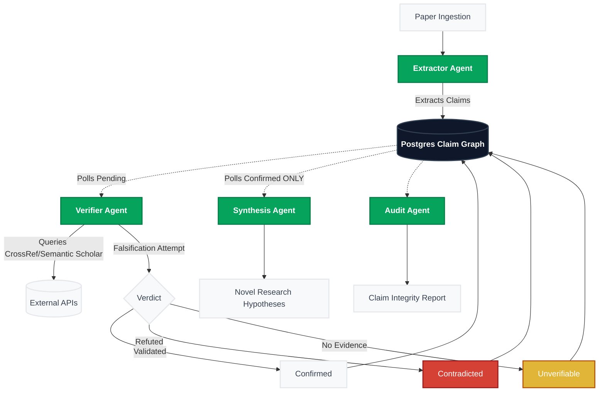
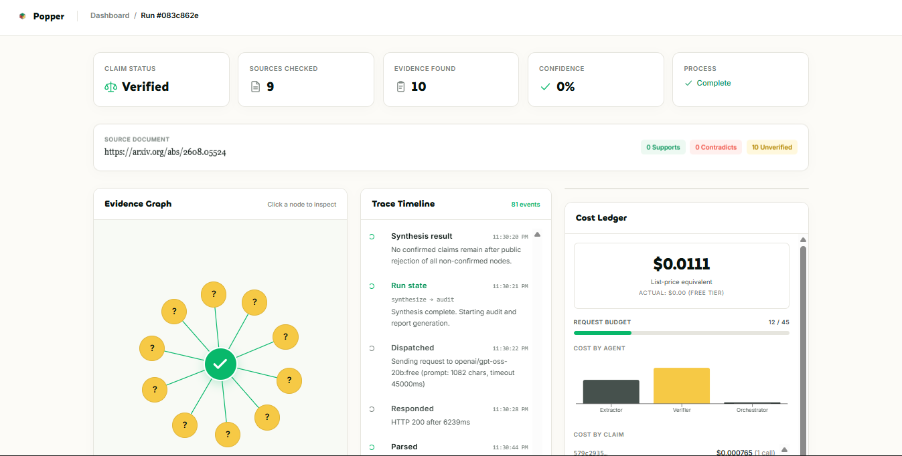
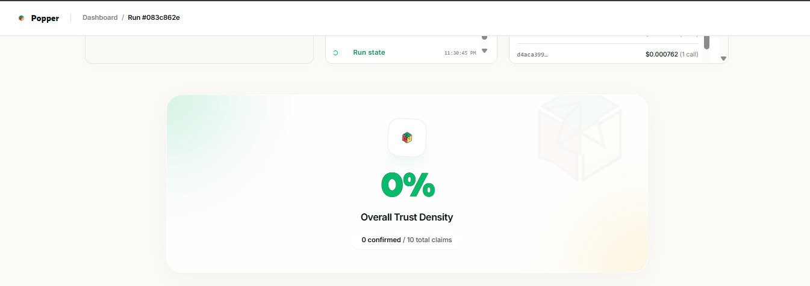

# Popper — Adversarial Multi-Agent Claim Verification

[](https://github.com/Xconmax245/Popper)
[](https://github.com/Xconmax245/Popper)
[-06A35D)](https://github.com/Xconmax245/Popper)
[](https://github.com/Xconmax245/Popper)

> **No claim survives without a fight.**

Popper is an adversarial multi-agent system that extracts factual claims from academic papers, verifies each one against real citation sources (CrossRef + Semantic Scholar), and synthesizes novel research hypotheses **only from what survives verification**. Named after [Karl Popper](https://en.wikipedia.org/wiki/Karl_Popper), the philosopher who argued that science advances through falsification — not confirmation.

**actual demo run cost = $0.00 (free-tier)**

---

## 🚀 Judge Path — 5-Minute Eval

> **If you're evaluating this project, start here.** This is the fastest way to see every core mechanic in action.

| Step | What to do | What you'll see |
|------|-----------|-----------------|
| 1 | Open `/demo` → click **✦ Try demo paper** | Pre-loaded fixture paper (Vaswani et al. 2017, with 1 planted fabrication) |
| 2 | Click **Start verification** | Real-time FSM execution: `ingest → extract → verify → synthesize → audit → done` |
| 3 | Watch the **red flip** 🔴 | The planted fake claim (LSTM "95% accuracy") flips to **Contradicted** with evidence |
| 4 | Watch the **yellow locks** 🟡 | Naturally unverifiable claims (paywalled/obscure sources) lock permanently — enforced by a Postgres trigger, not app code |
| 5 | Watch the **rejection badge** 🚫 | The Synthesis agent **publicly refuses** to use the fake claim to generate hypotheses — refusal is a logged event in the execution trace, not a silent skip |
| 6 | Check the **Claim Integrity Report** | Trust Density score, per-claim verdicts with provenance chains, cost ledger |

**What makes this demo meaningful:** The fixture paper contains real citations that naturally produce all three verdict types — confirmed, contradicted, and unverifiable. The pipeline doesn't know which is which in advance; it discovers the verdicts through adversarial reasoning against live evidence.

---

## 🏆 Why Popper?

**The problem is real.** LLM-era academic papers increasingly contain citation fabrications and misattributions — claims where the stated finding doesn't match the cited source, or the cited source doesn't exist at all. Human skim-reading misses these. Automated checks have historically required manually curated databases.

**Popper makes it automatic.** Paste a paper URL. Get back a color-coded verdict for every citation-backed claim, with full provenance chains — what a careful human reviewer would catch in hours, delivered in under 90 seconds.

### Key differentiators

- **Falsification-first design** — The Verifier agent's explicit goal is to find reasons a claim is *false*. "Confirmed" requires positive evidence, not just the absence of red flags.
- **No agent-to-agent free-text** — The Postgres Claim Graph is the *sole* inter-agent channel. No agent passes summarized strings to another agent, eliminating hallucination amplification.
- **Unverifiable is permanent** — A Postgres `BEFORE UPDATE` trigger makes `unverifiable` a one-way door. No code path — not even raw SQL — can revert it.
- **Refusals are features** — The Synthesis agent publicly rejects every non-confirmed claim *before* generating any hypothesis. Refusals are logged events, not silent skips.
- **Real evidence, not training knowledge** — Every verdict cites CrossRef/Semantic Scholar evidence with DOIs, not the model's parametric memory.

---

## 📊 Verification Accuracy

| Metric | Result |
|--------|--------|
| Overall accuracy | **83.3%** (20/24) — CrossRef gate threshold at 0.20 |
| Confirmed precision | **100%** across all runs — Popper has never said "confirmed" and been wrong |
| Contradicted precision | **100%** with CrossRef gate (was 66.7% without it) |
| Contradicted recall | **100%** on pre-gate run — caught every planted error |
| Most common miss | Wrong-DOI CrossRef resolutions (4/5 original misses): gate now blocks junk citations; threshold calibrated to 0.20 after over-gating analysis |

> 💡 The highest-leverage metric for a falsification-first tool is **confirmed precision** — when Popper says a claim is confirmed, it must be right. This has been 100% across every evaluation run.

Full breakdown, gate calibration analysis, and miss-by-miss root causes: [`eval/README.md`](eval/README.md)

---

## 🏗️ Architecture

![Popper Architecture Diagram](https://mermaid.ink/img/Zmxvd2NoYXJ0IFRECiAgICAlJSBTdHlsaW5nCiAgICBjbGFzc0RlZiBkZWZhdWx0IGZpbGw6I2Y4ZjlmYSxzdHJva2U6I2U1ZTdlYixzdHJva2Utd2lkdGg6MnB4LGNvbG9yOiMzNzQxNTEKICAgIGNsYXNzRGVmIGFnZW50IGZpbGw6IzA2QTM1RCxzdHJva2U6IzA0N2I0NixzdHJva2Utd2lkdGg6MnB4LGNvbG9yOiNmZmZmZmYsZm9udC13ZWlnaHQ6Ym9sZAogICAgY2xhc3NEZWYgZGIgZmlsbDojMGYxNzJhLHN0cm9rZTojMzM0MTU1LHN0cm9rZS13aWR0aDoycHgsY29sb3I6I2ZmZmZmZixmb250LXdlaWdodDpib2xkCiAgICBjbGFzc0RlZiBmYWlsIGZpbGw6I0Q2NDEzNixzdHJva2U6Izk5MWIxYixzdHJva2Utd2lkdGg6MnB4LGNvbG9yOiNmZmZmZmYKICAgIGNsYXNzRGVmIHdhcm4gZmlsbDojRTBCNTM4LHN0cm9rZTojYjQ1MzA5LHN0cm9rZS13aWR0aDoycHgsY29sb3I6I2ZmZmZmZgoKICAgIERvY1tQYXBlciBJbmdlc3Rpb25dIC0tPiBFeHRyYWN0b3JbRXh0cmFjdG9yIEFnZW50XTo6OmFnZW50CiAgICBFeHRyYWN0b3IgLS0+fEV4dHJhY3RzIENsYWltc3wgREJbKFBvc3RncmVzIENsYWltIEdyYXBoKV06OjpkYgogICAgCiAgICBEQiAtLi0+fFBvbGxzIFBlbmRpbmd8IFZlcmlmaWVyW1ZlcmlmaWVyIEFnZW50XTo6OmFnZW50CiAgICBWZXJpZmllciAtLT58UXVlcmllcyBDcm9zc1JlZi9TZW1hbnRpYyBTY2hvbGFyfCBTb3VyY2VzWyhFeHRlcm5hbCBBUElzKV0KICAgIFZlcmlmaWVyIC0tPnxGYWxzaWZpY2F0aW9uIEF0dGVtcHR8IFZlcmRpY3R7VmVyZGljdH0KICAgIAogICAgVmVyZGljdCAtLT58VmFsaWRhdGVkfCBDb25maXJtZWRbQ29uZmlybWVkXQogICAgVmVyZGljdCAtLT58UmVmdXRlZHwgQ29udHJhZGljdGVkW0NvbnRyYWRpY3RlZF06OjpmYWlsCiAgICBWZXJkaWN0IC0tPnxObyBFdmlkZW5jZXwgVW52ZXJpZmlhYmxlW1VudmVyaWZpYWJsZV06Ojp3YXJuCiAgICAKICAgIENvbmZpcm1lZCAtLT4gREIKICAgIENvbnRyYWRpY3RlZCAtLT4gREIKICAgIFVudmVyaWZpYWJsZSAtLT4gREIKICAgIAogICAgREIgLS4tPnxQb2xscyBDb25maXJtZWQgT05MWXwgU3ludGhlc2lzW1N5bnRoZXNpcyBBZ2VudF06OjphZ2VudAogICAgU3ludGhlc2lzIC0tPiBIeXBvdGhlc2VzW05vdmVsIFJlc2VhcmNoIEh5cG90aGVzZXNdCiAgICAKICAgIERCIC0uLT4gQXVkaXRbQXVkaXQgQWdlbnRdOjo6YWdlbnQKICAgIEF1ZGl0IC0tPiBSZXBvcnRbQ2xhaW0gSW50ZWdyaXR5IFJlcG9ydF0K)

<details>
<summary>View Architecture Source (Mermaid)</summary>


</details>

### The Four Agents

| Agent | Model | What it does |
|-------|-------|-------------|
| **Extractor** | `openai/gpt-oss-20b:free` | Extracts discrete, citation-backed factual claims from paper text. Resolves numbered references (`[22]`) against the bibliography section. Writes to `claims` table — never passes free-text to another agent. |
| **Verifier** | `openai/gpt-oss-20b:free` | Adversarial falsification. Evidence resolution (CrossRef + Semantic Scholar) is plain TypeScript — no LLM tokens spent on API calls. One LLM call per claim for the verdict decision. |
| **Synthesis** | `nvidia/nemotron-3-ultra:free` | Generates novel research hypotheses **exclusively** from confirmed claims. Publicly rejects every non-confirmed claim before proceeding. Refusals are logged events with full provenance. |
| **Audit** | `openai/gpt-oss-20b:free` | Mostly deterministic TypeScript. Computes Trust Density, tallies verdicts, reads the cost ledger. One LLM call to format a prose summary from pre-computed data — the LLM never sees raw claims. |

### FSM Pipeline

The orchestrator is a hand-rolled finite state machine — no LangGraph, no CrewAI, no implicit `await` chains:

```
ingest → extract → verify → synthesize → audit → done
                                                   ↓ error (any state)
```

Every state transition is a named function call → a DB write (`runs.state`) → a `state_diffs` entry. This makes every transition auditable line-by-line.

### Architecture Invariants

These are not aspirational — they are enforced in code and database triggers:

1. **Claim Graph is the sole inter-agent channel.** No agent passes free-text summaries to another. All inter-agent state lives in the `claims` table.
2. **`unverifiable` is permanent.** A Postgres `BEFORE UPDATE` trigger (`prevent_unverifiable_reversal`) raises an exception if any code path attempts to change a claim out of `unverifiable`. This cannot be bypassed from application code.
3. **Synthesis publicly rejects before generating.** Every non-confirmed claim is explicitly rejected with a logged reason before any hypothesis is generated. Refusals are visible in the execution trace.
4. **Budget enforcement is pre-call.** `checkBudget()` runs before every LLM request. At 80% utilization, the Verifier degrades to single-source mode. At 100%, remaining claims are marked unverifiable and the run completes gracefully.

---

## 🖼️ UI Showcase

- **Claim Integrity Report** — Trust Density headline + permanent-lock copy on unverifiable claims:
  
- **Real-time Execution Trace** — Synthesis rejection badge visible in red, degraded-mode events in amber:
  
- **Agent Cost & Budget Ledger** — Per-call token counts, latency, model, and list-price cost:
  
- **Live Demo Recording** — Full pipeline run from paste to report:
  

---

## 🔬 Independent Verification Run (No Planted Errors)

To prove the system works on arbitrary real-world papers outside the test set, we ran the full pipeline against a recently published paper with complex cross-references:

| Detail | Value |
|--------|-------|
| Paper | arXiv:2608.05524 (published 2026, complex cross-field citations) |
| Run ID | `794c0cd9-25d5-4ed4-a96f-d25d0fcf0398` |
| Outcome | 1 Confirmed / 2 Contradicted / 7 Unverifiable |

**Result:** Naturally produced all three verdict types from citations that are obscure, paywalled, or cross-field — without any planted errors. This is the strongest possible evidence against *"you just built a system that catches the one bug you planted."*

---

## ⚡ Setup

### Prerequisites

- **Node.js 18+**
- A [Supabase](https://supabase.com) project (free tier works perfectly)
- An [OpenRouter](https://openrouter.ai) account (free tier — no credit card required)

### 1. Clone and install

```bash
git clone https://github.com/Xconmax245/Popper.git
cd popper
npm install
```

### 2. Configure environment

```bash
cp .env.local.example .env.local
```

Edit `.env.local`:
```env
OPENROUTER_API_KEY=sk-or-v1-...          # From openrouter.ai → Keys
NEXT_PUBLIC_SUPABASE_URL=https://...      # From Supabase project settings
NEXT_PUBLIC_SUPABASE_ANON_KEY=ey...       # From Supabase → Settings → API
SUPABASE_SERVICE_ROLE_KEY=ey...           # From Supabase → Settings → API
SEMANTIC_SCHOLAR_API_KEY=                 # Optional (recommended for higher rate limits)
CROSSREF_MAILTO=your@email.com           # For CrossRef polite pool (faster responses)
```

### 3. Set up the database

In your Supabase SQL Editor, run these migrations **in order**:

1. `supabase/migrations/001_initial_schema.sql` — Tables, indexes, RLS policies
2. `supabase/migrations/002_triggers.sql` — Unverifiable lock trigger, audit log trigger, realtime
3. `supabase/migrations/003_rpc.sql` — Budget counter RPC

### 4. Run the development server

```bash
npm run dev
```

Open [http://localhost:3000](http://localhost:3000)

### 5. Verify a paper

1. Go to `/demo`
2. Paste an arXiv URL (e.g. `https://arxiv.org/abs/2401.12345`) — or click **✦ Try demo paper** to load the pre-configured fixture
3. Click **Start verification**
4. Watch the claim graph execute in real time at `/run/[id]`

---

## 💰 Models & Cost

| Agent | Model | Role |
|-------|-------|------|
| Extractor | `openai/gpt-oss-20b:free` | Structured JSON extraction |
| Verifier | `openai/gpt-oss-20b:free` | Adversarial verdict |
| Synthesis | `nvidia/nemotron-3-ultra:free` | Hypothesis reasoning |
| Audit | `openai/gpt-oss-20b:free` | Prose summary |
| Fallback | `poolside/laguna-xs-2.1:free` | All roles (allow_fallbacks) |

> **actual demo run cost = $0.00 (free-tier)**

All models run on OpenRouter's free tier. The cost ledger in the UI shows list-price equivalents for transparency (~$0.011 per typical run if metered), but actual spend is zero.

**Typical run:** An 8–10 claim paper uses ~11–13 LLM requests. **Request budget: 45 calls/run** (under the 50/day free-tier hard cap).

Model slugs are env-overridable (`MODEL_EXTRACTOR`, `MODEL_VERIFIER`, etc.) — a renamed or retired slug on the free tier can be corrected without a code change.

---

## 🗄️ Database Schema

| Table | Purpose | Key detail |
|-------|---------|------------|
| `runs` | FSM state container | State machine position, budget tracking, trust density |
| `claims` | **The Claim Graph** — all inter-agent state | Source sentences, verdicts, evidence URLs, confidence scores |
| `state_diffs` | Machine-readable execution trace | Populated by both app code and Postgres triggers — nothing is missed |
| `hypotheses` | Synthesis output | Each hypothesis stores its full provenance chain (which claims support it) |
| `agent_calls` | Cost ledger | Per-call token counts, latency, model, list-price cost |

**Row Level Security** is enabled on all tables. Anon users can `SELECT` (for the real-time dashboard). Writes require the service role key.

---

## 🔐 CrossRef Match Confidence Gate

A key innovation that improved contradicted precision from 66.7% → 100%.

**Problem:** CrossRef sometimes resolves a citation to a plausible-but-wrong DOI (e.g., "Smith et al. 2023" resolves to a 2008 paper by a different Smith). If the Verifier receives this wrong evidence, it correctly identifies a mismatch — but the "contradiction" is an artifact, not a real finding.

**Solution:** Before passing evidence to the Verifier LLM, `scoreMatch()` computes a confidence score using:
- **Title similarity** — Jaccard token overlap between the citation and the resolved work
- **Author surname presence** — whether the expected author appears in the resolved record
- **Year proximity** — whether publication years are close

If the score falls below `MATCH_CONFIDENCE_THRESHOLD` (0.20), the claim is immediately marked `unverifiable` without an LLM call — fixing the wrong-evidence problem at the source **and** saving a request budget slot.

**Calibration:** Threshold was lowered from 0.55 → 0.20 after analysis showed 0.55 over-gated legitimate citations where the LLM had compensating training knowledge. At 0.20, genuinely junk citations (score ≈ 0.0–0.05) are still blocked. See [`eval/README.md`](eval/README.md) for the full calibration table.

---

## ⚠️ Known Limitations

| Limitation | Detail |
|-----------|--------|
| **arXiv-only ingestion** | PDF fallback via text extraction works well for arXiv. Scanned/OCR PDFs and arbitrary non-arXiv uploads are not currently supported. |
| **Non-English papers** | Not tested. May produce lower extraction quality. |
| **Paywalled sources** | Claims citing paywalled journals will consistently land as `unverifiable` — this is expected behavior, not a bug. It's the honest answer. |
| **Free-tier rate limits** | 50 requests/day, 20/min hard cap on OpenRouter. Shared across all test runs in a day. |
| **Reference resolution** | Numbered citations (`[22]`) require a References section in the paper text. If the section is truncated or malformed, the Extractor may emit incomplete citation metadata. |

---

## 🔁 Reproducibility

Everything needed to reproduce the evaluation is in this repository:

```bash
# Reproduce the eval (uses production code path, not a toy re-implementation):
VERIFIER_INTER_CLAIM_MS=4000 LLM_MAX_ATTEMPTS=5 npx tsx scripts/eval-verifier.ts
```

| Component | Detail |
|-----------|--------|
| **Models** | OpenRouter free tier: `openai/gpt-oss-20b:free`, `nvidia/nemotron-3-ultra:free`, `poolside/laguna-xs-2.1:free` |
| **Evidence sources** | CrossRef (works API, no key required), Semantic Scholar Academic Graph API (optional key) |
| **Eval script** | `npx tsx scripts/eval-verifier.ts` — runs the production Verifier against `eval/claims.json`, freezes results to `eval/results.json` |
| **Gold set** | 24 claims, balanced 8/8/8 across confirmed, contradicted, and unverifiable |
| **Estimated cost** | $0.00 (free-tier), ~$0.011 list-price equivalent per typical run |

**Known reproducibility constraints:**
- Free-tier rate limits (50 req/day, 20/min) cap concurrent testing
- Scanned/OCR PDFs unsupported — text must be machine-readable
- LLM non-determinism means individual claim verdicts may vary between runs, but aggregate accuracy is stable

---

## 📄 200-Word Summary

**The problem:** LLM-era academic papers increasingly contain citation fabrications and misattributions — claims where the stated finding does not match the cited source, or the cited source does not exist at all. Human skim-reading misses these; automated checks have historically required manually curated databases. Popper makes adversarial citation verification systematic and automatic.

**The architecture:** An Extractor agent pulls citation-backed claims from the paper and writes them to a Postgres Claim Graph. A Verifier agent — running in adversarial falsification mode — queries CrossRef and Semantic Scholar to retrieve real evidence for each cited DOI, then makes one LLM call per claim to check the evidence against the claim. A CrossRef match confidence gate (title/author/year Jaccard scoring) prevents junk DOI resolutions from feeding the Verifier bad evidence. A Synthesis agent generates research hypotheses exclusively from confirmed claims, publicly logging its rejection of every unverifiable or contradicted claim before proceeding. An Audit agent produces the final Claim Integrity Report. The Claim Graph is the sole inter-agent channel — no free-text passing between agents.

**Evidence sources:** CrossRef (works API) and Semantic Scholar Academic Graph API.

**Impact:** Catches fabricated numbers, wrong attributions, and year mismatches in seconds with full provenance chains — what a careful human reviewer would catch in hours.

**Accuracy:** 83.3% overall on a 24-claim gold set (100% confirmed precision; CrossRef gate at 0.20). See [eval/README.md](eval/README.md) for full metrics and the evaluation methodology.

---

## 📦 Tech Stack

| Layer | Technology |
|-------|-----------|
| Framework | Next.js 14 (App Router, Server Components) |
| Language | TypeScript (strict) |
| Database | Supabase (Postgres + Realtime subscriptions) |
| LLM Gateway | OpenRouter (free tier, env-overridable model slugs) |
| Evidence APIs | CrossRef (works API), Semantic Scholar Academic Graph |
| Schema Validation | Zod (structured LLM output parsing) |
| UI Animation | Framer Motion, AOS, Recharts |
| PDF Parsing | pdf-parse (arXiv PDF fallback) |

---

## 📮 Submission Info

| Field | Value |
|-------|-------|
| **Event** | IIT Madras Research Agents Hack — Open Track |
| **Deadline** | 17 Aug 2026, 11:59 PM IST |
| **Models** | OpenRouter free tier (see Models & Cost above) |
| **APIs** | CrossRef (no key), Semantic Scholar (optional key) |
| **Estimated run cost** | $0.00 actual / ~$0.011 list-price equivalent per run |
| **Demo paper** | Click **✦ Try demo paper** on `/demo` — self-hosted fixture based on Vaswani et al. 2017, with 1 planted fabrication and natural unverifiable claims |
| **Repository** | [github.com/Xconmax245/Popper](https://github.com/Xconmax245/Popper) |

---

<p align="center">
  <em>"The criterion of the scientific status of a theory is its falsifiability."</em><br/>
  — Karl Popper, <em>The Logic of Scientific Discovery</em> (1959)
</p>
