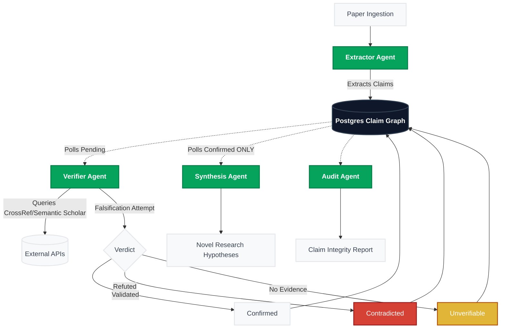

# Popper — Adversarial Multi-Agent Claim Verification

[](https://github.com/Xconmax245/Popper)

> **No claim survives without a fight.**

Popper is an adversarial multi-agent system that extracts factual claims from academic papers, verifies them against real citation sources (CrossRef + Semantic Scholar), and synthesizes research hypotheses only from what survives verification.

---

## Architecture



- **Extractor Agent** — `openai/gpt-oss-20b:free` — extracts citation-backed claims → writes to `claims` table
- **Verifier Agent** — `openai/gpt-oss-20b:free` — adversarial falsification, one LLM call per claim
- **Synthesis Agent** — `nvidia/nemotron-3-ultra:free` — hypotheses from confirmed-only claims, refusals logged
- **Audit Agent** — deterministic TypeScript + one LLM call for prose summary

**Claim Graph is the only inter-agent channel.** No agent passes free-text strings to another agent.

**Unverifiable is permanent.** Enforced by a Postgres `BEFORE UPDATE` trigger — cannot be bypassed from application code.

---

## Setup

### Prerequisites

- Node.js 18+
- A [Supabase](https://supabase.com) project (free tier works)
- An [OpenRouter](https://openrouter.ai) account with the "Project Free AI" preset configured

### 1. Clone and install

```bash
git clone https://github.com/Xconmax245/Popper.git
cd popper
npm install
```

### 2. Configure environment

```bash
cp .env.local.example .env.local
```

Edit `.env.local`:
```env
OPENROUTER_API_KEY=sk-or-v1-...          # From openrouter.ai
NEXT_PUBLIC_SUPABASE_URL=https://...      # From Supabase project settings
NEXT_PUBLIC_SUPABASE_ANON_KEY=ey...       # From Supabase project settings → API
SUPABASE_SERVICE_ROLE_KEY=ey...           # From Supabase project settings → API
SEMANTIC_SCHOLAR_API_KEY=                 # Optional but recommended
CROSSREF_MAILTO=your@email.com           # For CrossRef polite pool
```

### 3. Set up the database

In your Supabase SQL Editor, run these migrations in order:

1. `supabase/migrations/001_initial_schema.sql`
2. `supabase/migrations/002_triggers.sql`
3. `supabase/migrations/003_rpc.sql`

### 4. Run the development server

```bash
npm run dev
```

Open [http://localhost:3000](http://localhost:3000)

### 5. Verify a paper

1. Go to `/demo`
2. Paste an arXiv URL (e.g. `https://arxiv.org/abs/2401.12345`)
3. Click "Start verification"
4. Watch the claim graph animate in real time at `/run/[id]`

---

## Models & Cost

| Agent | Model | Role |
|---|---|---|
| Extractor | `openai/gpt-oss-20b:free` | Structured JSON extraction |
| Verifier | `openai/gpt-oss-20b:free` | Adversarial verdict |
| Synthesis | `nvidia/nemotron-3-ultra:free` | Hypothesis reasoning |
| Audit | `openai/gpt-oss-20b:free` | Prose summary |
| Fallback | `poolside/laguna-xs-2.1:free` | All roles (allow_fallbacks) |

**Actual cost: $0.00** (free tier). Cost ledger shows list-price equivalents.

**Request budget: 45 calls/run** (under the 50/day hard cap). For a 6–10 claim paper: ~9–13 requests total.

---

## UI Showcase

The Popper dashboard provides a real-time, completely transparent view of the adversarial process. 
*(Drop screenshots here before final submission!)*

- **Claim Integrity Report**: ``
- **Real-time Execution Trace**: ``
- **Agent Cost & Budget Ledger**: ``
- **Provenance Chain Visualization**: ``

---

## Database Schema

| Table | Purpose |
|---|---|
| `runs` | FSM state, budget tracking |
| `claims` | The Claim Graph — all inter-agent state |
| `state_diffs` | Audit log (populated by Postgres triggers) |
| `hypotheses` | Synthesis output with provenance |
| `agent_calls` | Cost ledger |

---

## Known Limitations

- **PDF parsing**: Not implemented. arXiv HTML and abstract pages are supported.
- **Non-English papers**: Not tested. May produce lower extraction quality.
- **Paywalled sources**: Claims citing paywalled journals will consistently land as `unverifiable` — this is expected behavior, not a bug.
- **Request budget**: 50 requests/day hard cap on OpenRouter free tier. Shared across all test runs.

---

## Submission Info

- **Event**: IIT Madras Research Agents Hack — Open Track
- **Deadline**: 17 Aug 2026, 11:59 PM IST
- **Models**: OpenRouter free tier (see above)
- **APIs**: CrossRef (no key), Semantic Scholar (optional key)
- **Estimated run cost**: $0.00 actual / ~$0.001–0.003 list-price equivalent
- **Demo paper**: See `/demo` — arXiv paper with 1 planted fabrication, 1 natural unverifiable
